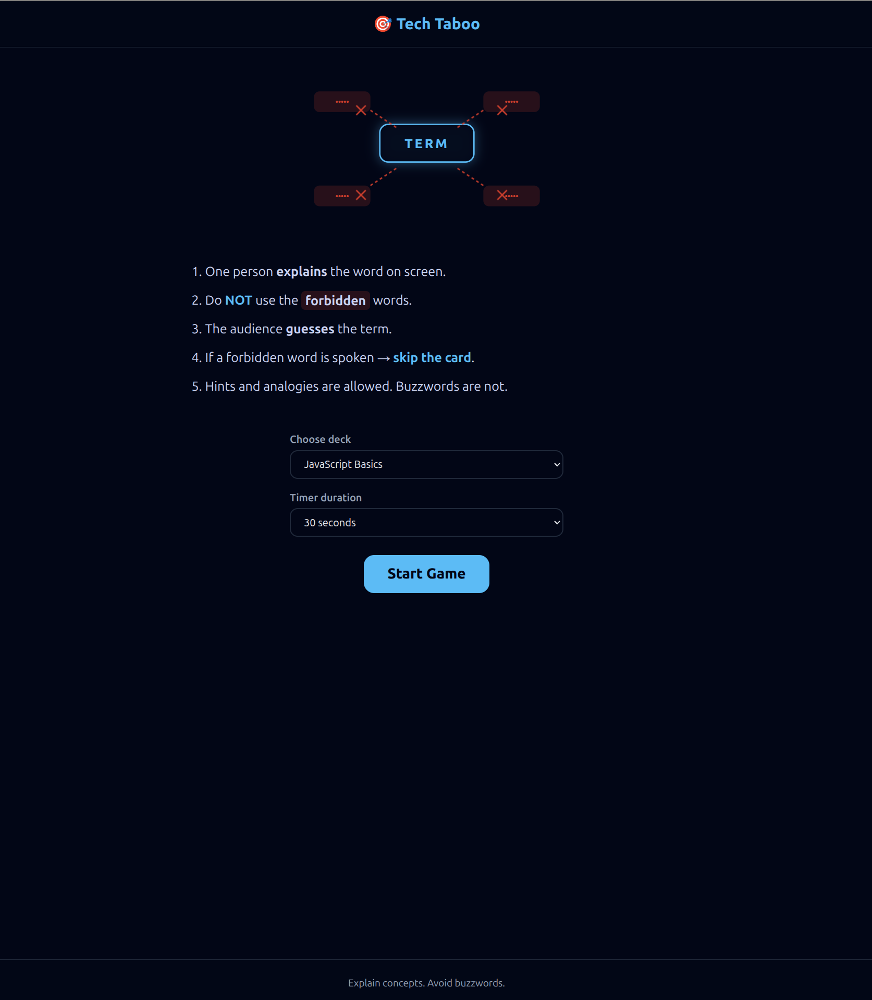
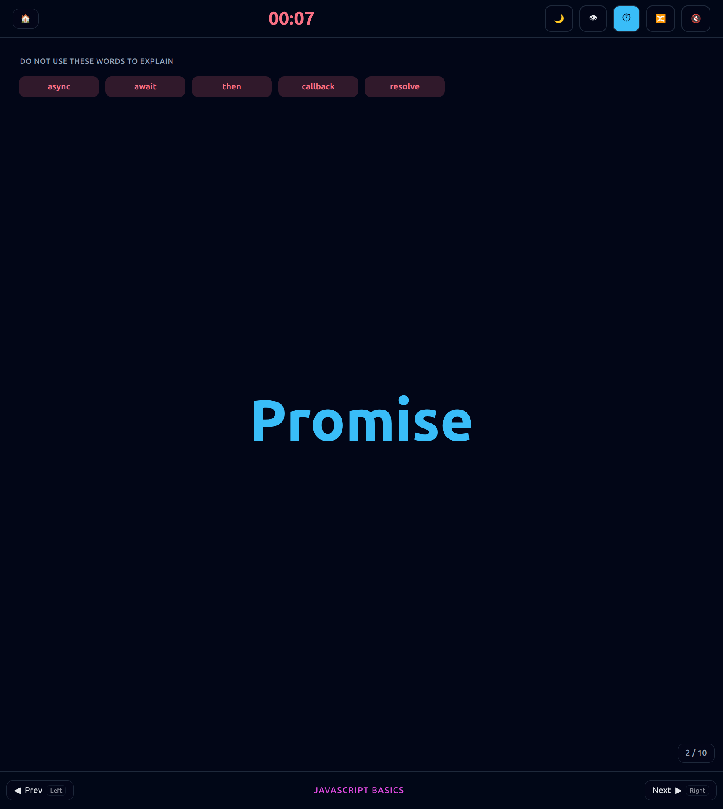
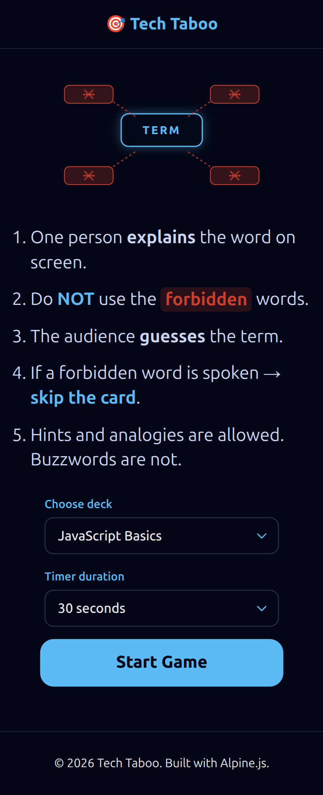
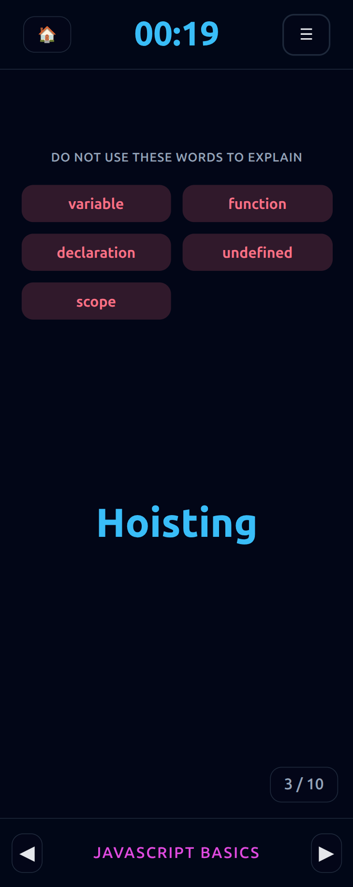

# Tech Taboo 🎯

Tech Taboo is a lightweight, open-source browser game inspired by the classic Taboo game.
The goal is simple: **explain a technical concept without using common buzzwords**.

It’s designed for JavaScript meetups, team learning sessions, onboarding, and interview prep —
anywhere clarity of understanding matters more than memorization.

👉 Live demo: <https://recursivezero.github.io/taboo>

---

## How the Game Works

- One player explains the **term shown on screen**
- A list of **forbidden words** is visible
- The audience tries to guess the term
- If a forbidden word is spoken → **skip the card**
- A **timer and buzzer** keep the pace fast
- Keyboard shortcuts and mobile support included

The game encourages explaining ideas clearly, without relying on buzzwords.

---

## Features

- 🧠 Concept-first learning (no buzzwords)
- ⏱ Timer with buzzer (mute supported)
- ⌨️ Keyboard shortcuts
- 📱 Mobile-friendly UI
- 🌗 Dark / Light theme
- 📦 JSON-based decks (easy to extend)
- 🚀 Fully static, no backend required

---

## Tech Stack (Intentionally Minimal)

- **HTML** – semantic markup
- **CSS** – responsive layout, animations, theming
- **Alpine.js** – lightweight state management
- **GitHub Pages** – hosting

No build tools. No framework lock-in. No backend.

---

## Screenshots

### Home Page

- Rules
- Select Deck
- Select Timer



### Game Page

- Header --> Home | Timer | Settings
- Main --> Forbidden Word List | Main Term in center of the page
- Footer -> Prev | Deck Name | Next



### Mobile View





## Project Structure

```plaintext
└── taboo/
    ├── CHANGELOG.md
    ├── LICENSE
    ├── README.md
    ├── assets/
    │   ├── decks/
    │   │   ├── css.json
    │   │   ├── html.json
    │   │   ├── index.json
    │   │   ├── javascript.json
    │   │   ├── react.json
    │   │   └── web.json
    │   ├── hint.svg
    │   ├── screenshots/
    │   │   ├── home.png
    │   │   └── game.png
    │   ├── sounds/
    │   │   └── buzzer.mp3
    │   └── styles/
    │       ├── rules.css
    │       └── taboo.css
    ├── index.html
    ├── js/
    │   └── taboo.js
    ├── partials/
    │   ├── footer.html
    │   └── header.html
    ├── taboo.code-workspace
    └── taboo.html
```

---

## Deck Format

Decks are simple JSON files.

Example:

```json
{
  "name": "JavaScript Basics",
  "cards": [
    {
      "term": "Closure",
      "forbidden": ["function", "scope", "variable", "lexical"]
    },
    {
      "term": "Promise",
      "forbidden": ["async", "await", "then", "callback"]
    }
  ]
}
```

### To add a new deck

1. Create a new JSON file in decks/

2. Add it to decks/index.json

3. Reload the app

No code changes needed.

---

Keyboard Shortcuts

Key Action

- <kbd>←</kbd> / <kbd>→</kbd> Previous / Next card
- <kbd>A</kbd> Toggle audience mode
- <kbd>S</kbd> Shuffle deck
- <kbd>T</kbd> Start / restart timer
- <kbd>M</kbd> Mute / unmute buzzer

---

## Why This Project Exists

In many tech discussions, people know the terminology but struggle to explain the underlying idea. Tech Taboo is a small experiment to encourage clear thinking, simple explanations, and better communication.

It was built in about 5–6 hours as a focused learning-in-public project.

---

## Contributing

Contributions are welcome. Some ideas you could explore:

- New decks (frontend, backend, system design, etc.)

- Team scoring mode

- Swipe-only navigation for mobile

- Accessibility improvements

- Visual timer indicators

Feel free to fork, experiment, and adapt it for your use case.

---

## License

MIT License
Use it, modify it, and share it freely.

---
